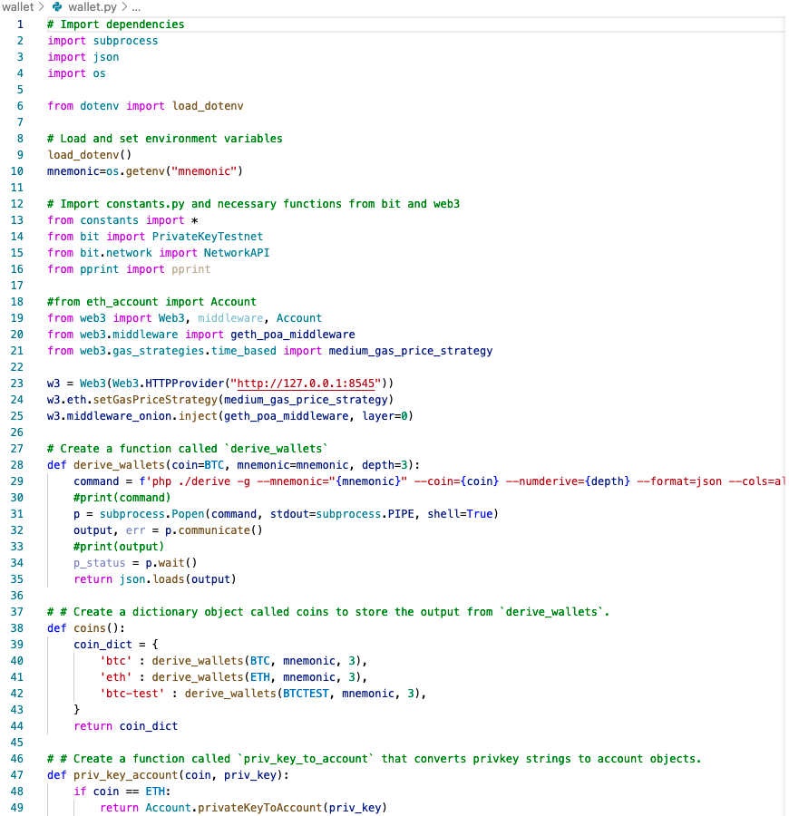
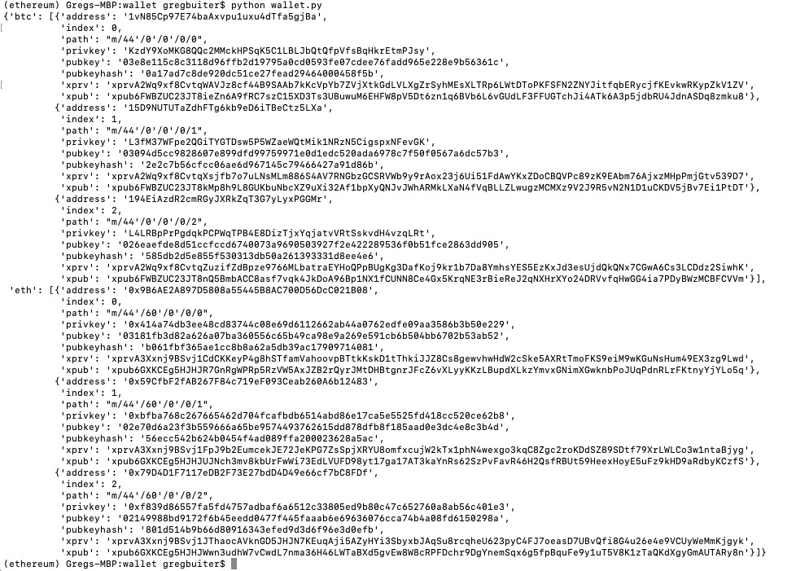
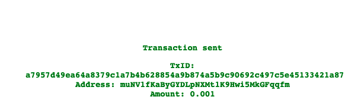
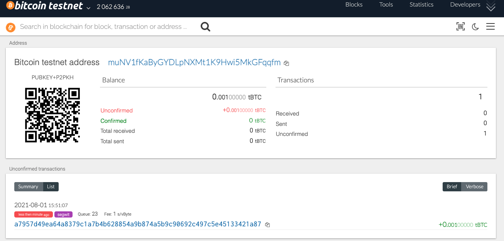
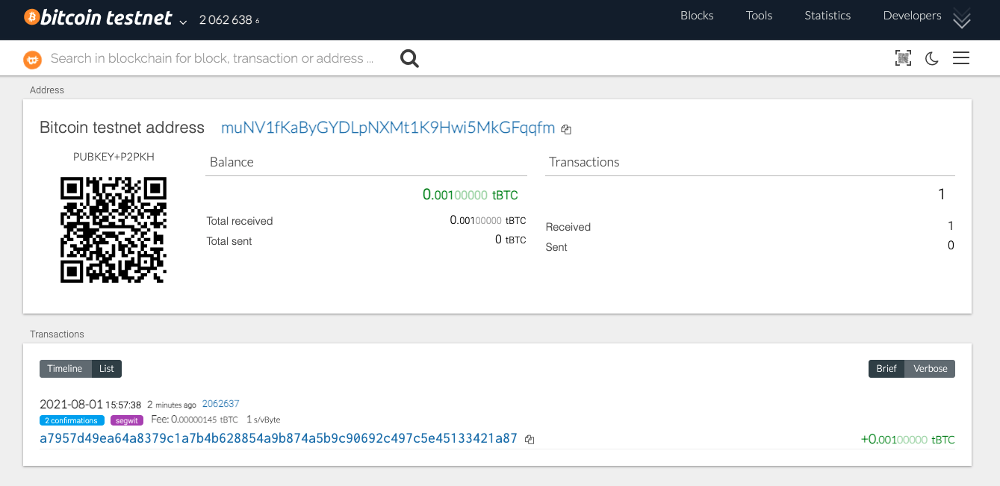
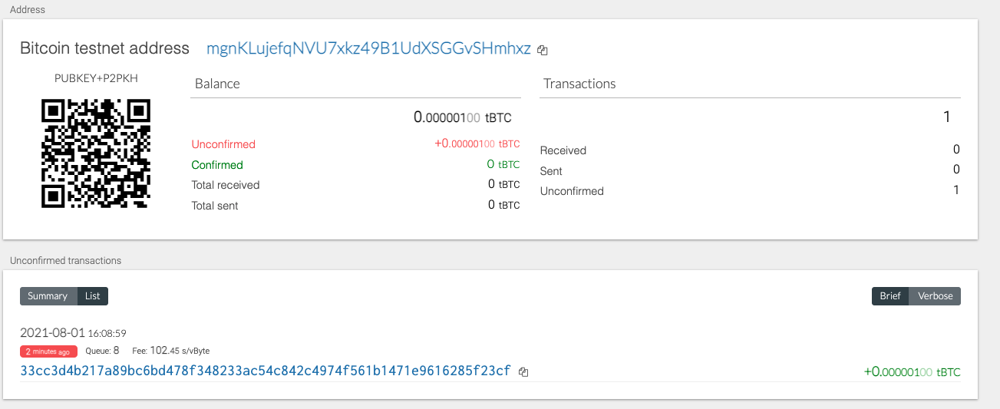
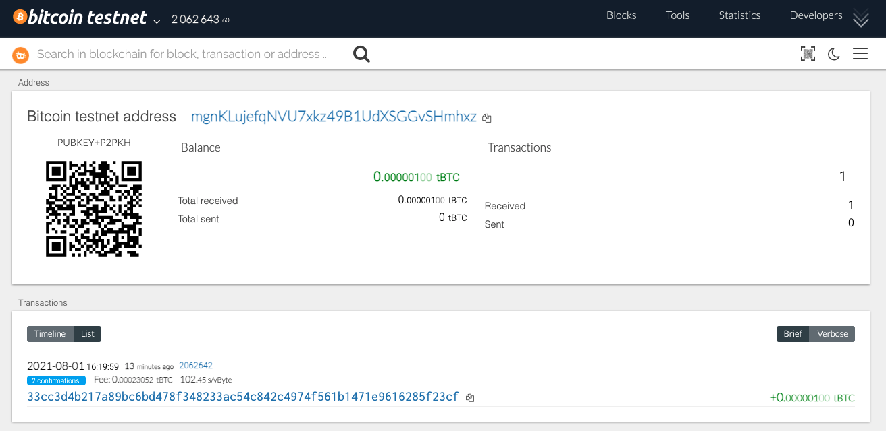

# Multi-Blockchain Wallet in Python

## Background and Wallet Description

Purpose: To create a universal wallet script using the command line tool, `hd-wallet-derive`.  This Python tool can manage multiple types of currencies in one wallet that supports BIP32, BIP39 and BIP44, but also as an "universal" wallet that can manage billions of addresses across 300+ coins. 

## Wallet.py Code

Created the Wallet.py file to hold the Python code to enable the program to act as my universal wallet script.

Initialized and created intial addresses with unique derivation paths, privkey, pubkeyhash, xprv and xpub.

Funded the initialize address with 0.001 BTC-TEST using testnet faucet.  Sent 0.001 BTC-TEST from faucet address "muNV1fKaByGYDLpNXMt1K9Hwi5MkGFqqfm" to address "mgnKLujefqNVU7xkz49B1UdXSGGvSHmhxz"

Transaction "unconfirmed".

Transaction "confirmed" and account funded.

Sent transaction (0.000001 BTCTEST) using wallet.py sendtx function.

Confirmation of sending 0.0000001 BTCTEST on biction testnet block explorer.

